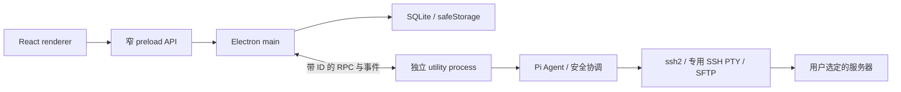

# 架构说明

本文说明当前代码结构。产品流程见[使用指南](USER_GUIDE.md)，防护语义见[安全与数据边界](SECURITY.md)，未完成项目见[验收状态](STATUS.md)。

## 技术栈

| 领域 | 当前实现 |
| --- | --- |
| 桌面与语言 | Electron 44.5.1、Node.js 24、严格 TypeScript |
| 界面 | React 19、CSS Modules、CSS 变量、Zustand |
| 工程 | pnpm workspace、electron-vite、electron-builder |
| 终端与 SSH | xterm.js 6、ssh2 1.17 |
| 模型 | `@earendil-works/pi-ai`、`@earendil-works/pi-agent-core` 0.99.1 |
| AI 审核 | Pi 分类接口调用 Vercel Gateway 的 `typesafe-ai/jev`，或当前模型独立审核 |
| Shell 分析 | web-tree-sitter 与随应用分发的 Bash WASM |
| 数据与校验 | SQLite、better-sqlite3、Drizzle、TypeBox |
| 凭据保护 | 主进程使用 Electron safeStorage |
| 验证 | Vitest、Playwright、ESLint、TypeScript、dependency-cruiser |

确切依赖版本以各 workspace 的 `package.json` 和锁文件为准。没有引入 Vercel AI SDK。Adapters 使用 Pi Coding Agent 的原生会话、语义压缩和只读分页工具；不开放其内置 Shell、写入或编辑能力。

## 分层依赖

```text
application → core
adapters → core
desktop 的 main / worker 装配层 → application + adapters + contracts
renderer / preload → contracts
```

这里表示源码导入方向，不表示运行时消息的单向流动。Core 不依赖应用层、适配器或桌面实现；适配器不得互相导入具体实现。后端状态为权威记录，Zustand 只保存界面投影和交互状态。

核心端口包括 `CommandAnalyzer`、`RiskEvaluator`、`ApprovalRequester`、`OperationExecutor`、`OperationAudit`、`TerminalLease` 和 `RawTerminal`。Pi 与 SSH 的具体实现由桌面 worker 装配，不让界面直接调用。

[dependency-cruiser 规则](../.dependency-cruiser.cjs)检查循环、反向及跨层依赖；[行数检查](../scripts/check-lines.mjs)限制手写源文件规模。复用能力拆到职责明确的模块，不建立通用执行或万能工具入口。

## 进程边界



- **Renderer**：三栏界面、Markdown、终端显示、表单和审核卡，不拥有通用解密或任意执行 API。
- **Preload**：通过 `contextBridge` 暴露明确的 `DesktopAPI`；窗口开启 context isolation、sandbox，关闭 Node integration。
- **Main**：窗口、系统文件选择器、凭据加解密、持久化、IPC 参数处理、运行进程管理。
- **Utility process**：SSH 连接、终端控制、Pi 循环、命令审核、文件操作、输入桥和结果核验。
- **远端**：没有常驻 CloudHelm Agent；首次获批执行时通过 SFTP 放置固定的 Python 3 进程传输组件，每次操作短暂启动；会话关闭时清理，断线时清理可能延后。不生成包含业务命令的包装脚本。

## 对话与主机修订

界面使用 `startConversation`、`sendMessage`、`setConversationModel` 等动作。首条消息绑定一个主机或空授权；切换标签不改变既有对话的授权目标。后台的 `TaskView`／`TaskRunner` 是执行记录的技术名称，不对应用户必须创建的任务。

[主机状态管理](../apps/desktop/src/main/app-state.ts)在连接参数变化时创建新修订，旧终端和对话仍引用旧修订，避免连接被悄悄重定向。当前新对话只开放单主机，旧多主机历史只读。

[连接测试协调](../apps/desktop/src/main/host-connection-test.ts)读取未保存表单，构造独立测试身份；不会写入配置或主机状态。指纹确认用单次令牌绑定当前配置和凭据摘要，两分钟过期。worker 使用独立 `SshTransport`，在完成或失败后清理连接；45 秒期限也覆盖跳板转发等待。测试不建立 PTY、不运行命令，测试信任不永久保存。

## Agent 执行链路

| 模块 | 单一职责 |
| --- | --- |
| [TaskRunner](../apps/desktop/src/worker/task-runner.ts) | 协调对话生命周期、Pi 循环、请求预算与执行状态 |
| [ConversationModel](../apps/desktop/src/worker/conversation-model.ts) | 管理已选模型与当前请求快照 |
| [remote-tools](../apps/desktop/src/worker/remote-tools.ts) | 将模型工具调用转换为授权范围内的操作提议 |
| [SafetyGate](../packages/application/src/safety-gate.ts) | 分析、审核、记录决策并执行前复核 |
| [HostSerialExecutor](../packages/application/src/host-serial-executor.ts) | 同主机 Agent 操作串行与未知结果写锁 |
| [TerminalManager](../packages/application/src/terminal-manager.ts) | 真实 PTY、输入权、执行状态和终端代次 |
| [InteractionCoordinator](../packages/application/src/interaction-coordinator.ts) | 绑定、投递和作废操作交互请求 |
| [WorkJournal](../apps/desktop/src/worker/work-journal.ts) | 计划、日志检索、结果核验和验收证据 |

命令提议经过“硬禁令 → 完整低风险白名单 → 当前档位 → 执行前复核”后才执行。SFTP 写入、删除和上传也经过同一入口。主机写锁在跨对话间共享；仍在运行或结果未知的写操作阻止后续变更，只读核验可继续。

Agent 终端通过结构化进程通道执行普通命令：字面量命令直接作为 argv 启动；受支持的 sudo 前台列表由 Bash AST 提取，按分号和条件连接顺序分别派发，每次派发复核授权，无法可靠解析的 sudo 形式要求停止 AI 后人工处理。其余含 Shell 语法的命令才交给 Bash 解释原文。目录和干净环境由进程 API 设置；输出与退出码分开传输，不追加 printf 标记。远端需要 Python 3，组件不可用时暂停，不降级到脚本包装。运行中的 AI 终端拒绝人工输入；停止按钮或 Ctrl+C 撤销本轮执行权限并尝试中断远端命令，实际结果仍需核验。空闲终端自动释放供人工输入；只有用户发送消息或明确继续才启动 AI 并按需新建受控会话。用户中断元数据附在操作与历史消息上，下一轮及重启恢复时保留。

提示符和原命令回显通过 `RawTerminal.onDisplay` 投影到终端，与 `onData` 的实际进程输出分开，避免混入工具结果。远端生成标准 Bash 样式提示符；`fitTerminal` 使用 xterm FitAddon 测量行列，启动和调整大小均同步至 PTY。

审核拒绝、认证失败、停止或未知结果会在 TaskRunner 后端阻止继续远端工作，包括同批工具调用与新建终端；用户明确继续后才恢复。

## 模型、上下文和证据

每次请求固定模型与凭据快照，界面切换在下一次请求边界生效；操作审核沿用产生该操作的请求配置。全局默认只影响新对话，Key／地址修订变化后旧对话恢复前需要明确重选。

CloudHelm 保存权威任务、审核和操作记录；[原生会话适配器](../packages/adapters/src/pi-session.ts)通过 `AgentSession`、`SessionManager` 管理完整模型 transcript、工具元数据和语义压缩。Utility process 独占写入 `userData/pi-sessions/<taskId>/*.jsonl`；SQLite 只绑定会话 ID，并缓存按 SDK entry ID 去重的消息投影。重启恢复严格校验绑定和 JSONL，缺失或损坏时拒绝继续，不退回空会话；恢复本身不请求模型、不执行工具。显式继续时注入当前权威操作结果，未知结果仍先核验。

上下文占用由 SDK `getContextUsage()` 提供，不累计会话消耗，不计未发送草稿。压缩后缺少新 usage、重启或模型切换时显示待统计；估算与模型统计分别标明来源。压缩使用 SDK 摘要请求并计入请求上限，失败或取消后暂停。关闭模型／供应商自动重试、缓存预热、网络模型目录刷新及环境凭据回退；拦截会自动重试的溢出压缩。模型选择在下一请求准备边界应用，并先于该请求的自动压缩。

会话只启用 CloudHelm 明确注册的工具和内置澄清扩展；不发现用户／项目的 Pi 资源。授权、凭据和终端控制权始终由 CloudHelm 重新校验。SDK 原生 read 负责 offset/limit 和输出截断，主机仍校验用户选定范围、符号链接、UTF-8 和 1 MiB 文件上限。

迁移 0004 只运行一次：清理旧消息正文、旧模型请求缓存和旧澄清运行状态，旧任务元数据、操作审计及日志保留为只读；主机、凭据、保护路径、模型与快捷键配置保留。新会话 JSONL 不导入旧的展示文本。普通进程崩溃恢复经过桌面 smoke 验证；同步写入不等同于断电级耐久保证。

默认主模型请求上限为 100；重复失败或拒绝达到 3 次、连续 10 轮没有记录到新操作时暂停。长命令的正常等待不单独计作一轮。运行时有请求上限字段，目前未提供完整的用户可调预算页面。

验收报告必须引用本对话已成功的操作；未完成或未知结果会阻止验收。新的用户补充和新操作会使旧报告失效。恢复时旧历史只能作为背景，不是新的执行授权或验证证据。

## 数据与恢复

[SqliteStore](../packages/adapters/src/sqlite-store.ts)使用 WAL，保存主机修订、对话、操作、审批相关记录、模型配置和分块终端日志。版本化迁移 `migration0001` 至 `migration0003` 当前定义在该源码文件，版本写入 `schema_migrations`，不是独立 SQL 文件目录。

凭据在主进程经 safeStorage 加密后存入数据库。普通日志采用流式脱敏和分页读取，默认清理超过 30 天或总量超出 5 GiB 的数据；这不是任意敏感内容的识别保证。当前没有日志固定保留 UI，也没有远端辅助记录的七天定时回收器。

应用重启或运行进程故障后，未明确完成的操作进入结果未知状态。后续先重新连接和只读核验，再解除对应操作的写锁；不自动重放命令，不承诺重新接管已失去控制的远端前台进程。

退出确认发生在可取消的 `before-quit` 阶段，资源仅在 `will-quit` 中释放一次。RuntimeBridge 拒绝未完成调用并忽略迟到事件，AppState 先刷新日志再封闭写入，避免重复退出或取消退出后访问已关闭的 SQLite。
