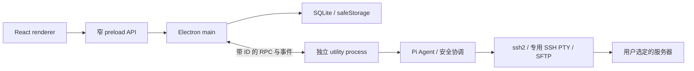

# 架构说明

本文说明当前代码结构。产品流程见[使用指南](USER_GUIDE.md)，防护语义见[安全与数据边界](SECURITY.md)，未完成项目见[验收状态](STATUS.md)。

## 技术栈

| 领域 | 当前实现 |
| --- | --- |
| 桌面与语言 | Electron 44.5.1、Node.js 24、严格 TypeScript |
| 界面 | React 19、CSS Modules、CSS 变量、Zustand |
| 工程 | pnpm workspace、electron-vite、electron-builder |
| 终端与 SSH | xterm.js 6、ssh2 1.17 |
| 模型 | `@earendil-works/pi-ai`、`@earendil-works/pi-agent-core` 0.99.1 |
| AI 审核 | Pi 分类接口调用 Vercel Gateway 的 `typesafe-ai/jev`，或当前模型独立审核 |
| Shell 分析 | web-tree-sitter 与随应用分发的 Bash WASM |
| 数据与校验 | SQLite、better-sqlite3、Drizzle、TypeBox |
| 凭据保护 | 主进程使用 Electron safeStorage |
| 验证 | Vitest、Playwright、ESLint、TypeScript、dependency-cruiser |

确切依赖版本以各 workspace 的 `package.json` 和锁文件为准。没有引入 Vercel AI SDK。Adapters 使用 Pi Coding Agent 的原生会话、语义压缩和只读分页工具；不开放其内置 Shell、写入或编辑能力。

## 分层依赖

```text
application → core
adapters → core
desktop 的 main / worker 装配层 → application + adapters + contracts
renderer / preload → contracts
```

这里表示源码导入方向，不表示运行时消息的单向流动。Core 不依赖应用层、适配器或桌面实现；适配器不得互相导入具体实现。后端状态为权威记录，Zustand 只保存界面投影和交互状态。

核心端口包括 `CommandAnalyzer`、`RiskEvaluator`、`ApprovalRequester`、`OperationExecutor`、`OperationAudit`、`TerminalLease` 和 `RawTerminal`。Pi 与 SSH 的具体实现由桌面 worker 装配，不让界面直接调用。

[dependency-cruiser 规则](../.dependency-cruiser.cjs)检查循环、反向及跨层依赖；[行数检查](../scripts/check-lines.mjs)限制手写源文件规模。复用能力拆到职责明确的模块，不建立通用执行或万能工具入口。

## 进程边界



- **Renderer**：三栏界面、Markdown、终端显示、表单和审核卡，不拥有通用解密或任意执行 API。
- **Preload**：通过 `contextBridge` 暴露明确的 `DesktopAPI`；窗口开启 context isolation、sandbox，关闭 Node integration。
- **Main**：窗口、系统文件选择器、凭据加解密、持久化、IPC 参数处理、运行进程管理。
- **Utility process**：SSH 连接、终端控制、Pi 循环、命令审核、文件操作、输入桥和结果核验。
- **远端**：没有常驻 CloudHelm Agent；首次获批执行时通过 SFTP 放置固定的 Python 3 进程传输组件，每次操作短暂启动；会话关闭时清理，断线时清理可能延后。不生成包含业务命令的包装脚本。

## 对话与主机修订

界面使用 `startConversation`、`sendMessage`、`setConversationModel` 等动作。首条消息绑定一个主机或空授权；切换标签不改变既有对话的授权目标。后台的 `TaskView`／`TaskRunner` 是执行记录的技术名称，不对应用户必须创建的任务。

[主机状态管理](../apps/desktop/src/main/app-state.ts)在连接参数变化时创建新修订，旧终端和对话仍引用旧修订，避免连接被悄悄重定向。当前新对话只开放单主机，旧多主机历史只读。

[连接测试协调](../apps/desktop/src/main/host-connection-test.ts)读取未保存表单，构造独立测试身份；不会写入配置或主机状态。指纹确认用单次令牌绑定当前配置和凭据摘要，两分钟过期。worker 使用独立 `SshTransport`，在完成或失败后清理连接；45 秒期限也覆盖跳板转发等待。测试不建立 PTY、不运行命令，测试信任不永久保存。

## Agent 执行链路

| 模块 | 单一职责 |
| --- | --- |
| [TaskRunner](../apps/desktop/src/worker/task-runner.ts) | 协调对话生命周期、Pi 循环、请求预算与执行状态 |
| [PiConversationSession](../packages/adapters/src/pi-session.ts) | 原生会话、模型与思考档位的请求边界、上下文投影 |
| [remote-tools](../apps/desktop/src/worker/remote-tools.ts) | 将模型工具调用转换为授权范围内的操作提议 |
| [SafetyGate](../packages/application/src/safety-gate.ts) | 分析、审核、记录决策并执行前复核 |
| [HostSerialExecutor](../packages/application/src/host-serial-executor.ts) | 同主机 Agent 操作串行与未知结果写锁 |
| [TerminalManager](../packages/application/src/terminal-manager.ts) | 真实 PTY、输入权、执行状态和终端代次 |
| [InteractionCoordinator](../packages/application/src/interaction-coordinator.ts) | 绑定、投递和作废操作交互请求 |
| [WorkJournal](../apps/desktop/src/worker/work-journal.ts) | 计划、日志检索、结果核验和验收证据 |

命令提议经过“身份与凭据底线 → 硬禁令 → 方向性保护路径 → Bash 解析与影响识别 → 当前对话档位 → 执行前复核”后才执行。可识别的远端脚本先经 SFTP 只读检查，执行前重查摘要。SFTP 写入、删除和上传也经过同一入口。主机写锁在跨对话间共享；仍在运行或结果未知的写操作阻止后续变更，只读核验可继续。

Agent 终端通过结构化进程通道执行普通命令：字面量命令直接作为 argv 启动；受支持的 sudo 前台列表由 Bash AST 提取，按分号和条件连接顺序分别派发，每次派发复核授权，无法可靠解析的 sudo 形式要求停止 AI 后人工处理。其余含 Shell 语法的命令才交给 Bash 解释原文。目录和干净环境由进程 API 设置；输出与退出码分开传输，不追加 printf 标记。远端需要 Python 3，组件不可用时暂停，不降级到脚本包装。运行中的 AI 终端拒绝人工输入；停止按钮或 Ctrl+C 撤销本轮执行权限并尝试中断远端命令，实际结果仍需核验。空闲终端自动释放供人工输入；只有用户发送消息或明确继续才启动 AI 并按需新建受控会话。用户中断元数据附在操作与历史消息上，下一轮及重启恢复时保留。

提示符和原命令回显通过 `RawTerminal.onDisplay` 投影到终端，与 `onData` 的实际进程输出分开，避免混入工具结果。远端生成标准 Bash 样式提示符；`fitTerminal` 使用 xterm FitAddon 测量行列，启动和调整大小均同步至 PTY。

独立 AI 审核拒绝只阻止当前操作；同一操作的新 ID 重试也被直接拦截，连续三次 AI 拒绝使任务暂停。用户可主动要求对一次 AI 拒绝做精确人工复核。用户拒绝、认证失败、停止或未知结果会在 TaskRunner 后端阻止继续远端工作，包括同批工具调用与新建终端；用户明确继续后才恢复。

## 模型、上下文和证据

### 有序消息与终端引用

`MessageDocument` 按顺序保存文字、终端引用和粘贴资料片段；Renderer 的原子标签编辑器管理光标、粘贴折叠与按对话隔离的内存草稿。引用添加时固定草稿键和来源终端，异步返回不会跟随当前界面切换。发送准备锁与请求 ID 保存在草稿状态中，收起侧栏不会解除锁。

主进程 `ReferenceStore` 按命令起止事件保存独立日志，以完整长度校验生成不可变快照，不复用终端尾部读取。AI 终端边界来自执行记录；人工终端通过会话级 Bash/Zsh 标记采集，临时启动文件用后清理，不改写用户配置。Zsh 读取原有 env/profile/rc/login；Bash 启动垫片读取系统和用户登录配置，在支持 PS0 的 Bash 4.4+ 安装钩子。禁止历史记录或会隐藏命令的 Bash 配置、不支持的 Shell、标记失效均退回手动选区；不猜测提示符。原文保存前脱敏，认证通道不经过采集路径。

主进程校验引用的主机绑定，为每条消息生成独立引用实例；Application 的 `prepareMessage` 按模型容量、当前上下文、回复预留量决定是否压缩，Adapters 使用当前 Pi 模型进行无工具的独立总结。容量采用保守 UTF-8 估算，并在准备结束时复核会话增长；没有提供商级精确 tokenizer 的保证。超大原文分段再合并，不静默截断；失败或取消不派发部分消息。SQLite 发送回执记录 preparing/dispatching/sent/failed，结果不明的派发拒绝自动重放。

迁移 0005 新增引用正文表，原文与可选总结按需读取，不放入全量界面快照。Pi 原生用户 entry ID 通过 `cloudhelm-message-document` 自定义记录关联结构化展示，模型实际收到展开后的内容；恢复标签不解析正文。终端关闭或重启后已发送引用仍可读取，旧纯文本消息保持兼容。引用及总结是资料，远端变更仍经过原有 SafetyGate。

### 会话与容量

每次请求固定模型与凭据快照，界面切换在下一次请求边界生效；操作审核沿用产生该操作的请求配置。全局默认只影响新对话，Key／地址修订变化后旧对话恢复前需要明确重选。

CloudHelm 保存权威任务、审核和操作记录；[原生会话适配器](../packages/adapters/src/pi-session.ts)通过 `AgentSession`、`SessionManager` 管理完整模型 transcript、工具元数据和语义压缩。Utility process 独占写入 `userData/pi-sessions/<taskId>/*.jsonl`；SQLite 只绑定会话 ID，并缓存按 SDK entry ID 去重的消息投影。重启恢复严格校验绑定和 JSONL，缺失或损坏时拒绝继续，不退回空会话；恢复本身不请求模型、不执行工具。显式继续时注入当前权威操作结果，未知结果仍先核验。

上下文占用由 SDK `getContextUsage()` 提供，不累计会话消耗，不计未发送草稿。压缩后缺少新 usage、重启或模型切换时显示待统计；估算与模型统计分别标明来源。压缩使用 SDK 摘要请求并计入请求上限，失败或取消后暂停。关闭模型／供应商自动重试、缓存预热、网络模型目录刷新及环境凭据回退；拦截会自动重试的溢出压缩。模型选择在下一请求准备边界应用，并先于该请求的自动压缩。

会话只启用 CloudHelm 明确注册的工具和内置澄清扩展；不发现用户／项目的 Pi 资源。授权、凭据和终端控制权始终由 CloudHelm 重新校验。SDK 原生 read 负责 offset/limit 和输出截断，主机仍校验用户选定范围、符号链接、UTF-8 和 1 MiB 文件上限。

迁移 0004 只运行一次：清理旧消息正文、旧模型请求缓存和旧澄清运行状态，旧任务元数据、操作审计及日志保留为只读；主机、凭据、保护路径、模型与快捷键配置保留。新会话 JSONL 不导入旧的展示文本。普通进程崩溃恢复经过桌面 smoke 验证；同步写入不等同于断电级耐久保证。

默认主模型请求上限为 100；重复失败或拒绝达到 3 次、连续 10 轮没有记录到新操作时暂停。长命令的正常等待不单独计作一轮。运行时有请求上限字段，目前未提供完整的用户可调预算页面。

验收报告必须引用本对话已成功的操作；未完成或未知结果会阻止验收。新的用户补充和新操作会使旧报告失效。恢复时旧历史只能作为背景，不是新的执行授权或验证证据。

## 数据与恢复

[SqliteStore](../packages/adapters/src/sqlite-store.ts)使用 WAL，保存主机修订、对话、操作、审批相关记录、模型配置和分块终端日志。版本化迁移 `migration0001` 至 `migration0003` 当前定义在该源码文件，版本写入 `schema_migrations`，不是独立 SQL 文件目录。

凭据在主进程经 safeStorage 加密后存入数据库。普通日志采用流式脱敏和分页读取，默认清理超过 30 天或总量超出 5 GiB 的数据；这不是任意敏感内容的识别保证。当前没有日志固定保留 UI，也没有远端辅助记录的七天定时回收器。

应用重启或运行进程故障后，未明确完成的操作进入结果未知状态。后续先重新连接和只读核验，再解除对应操作的写锁；不自动重放命令，不承诺重新接管已失去控制的远端前台进程。

退出确认发生在可取消的 `before-quit` 阶段，资源仅在 `will-quit` 中释放一次。RuntimeBridge 拒绝未完成调用并忽略迟到事件，AppState 先刷新日志再封闭写入，避免重复退出或取消退出后访问已关闭的 SQLite。


## 停止、重连与成熟执行机制

输入区同一按钮在空闲时发送，模型、工具或受控远端命令仍在执行时停止。Enter 始终只发送补充消息，Shift+Enter 换行；正在停止时保留草稿与附件，不继续投递。Worker 的 execution 投影分别记录模型活动、远端运行/未知、停止请求；IPC 完成或 abort 不能证明远端退出。只有 PTY 的退出事件能确认前台结束。若连接丢失，显示结果待核验，不能再向已失去的进程发送停止信号。

精确相同的操作使用独立于终端代次的内容摘要识别（主机、目录、身份、完整命令/文件内容），摘要不代替 SafetyGate 批准。当前执行轮和恢复期间拒绝已成功或未决动作的再次派发；正常完成后用户新发起一轮可有意重复操作。改变命令写法的语义重复不能仅靠摘要识别，仍需模型检查原日志和实际状态。未知以及可能部分生效的失败阻止同主机后续写入；新只读证据、显式核验记录才能解除。迟到退出结果也参与这一判断。模型 HTTP 重试与操作重放均没有自动启用。

Python 3 的 POSIX/pty 依赖检查按 SSH 连接代次缓存成功结果；每次实际启动只检查本次可执行文件和工作目录，并由进程启动返回实际权限错误。不会缓存可变目录权限或安装任何依赖。缺 Python 或传输组件安装失败明确记录业务命令未发送；启动后的断线仍按未知处理。任意 Shell 内部动态调用和 sudo 目标身份的完整权限无法在启动前证明，仍以原生命令与私密认证通道的结果为准。

本轮选择现有 Linux systemd 服务作为可恢复流程的最小落地范围，新增 `manage_service` 的 inspect/restart/logs。restart 顺序执行：检查 loaded/CanStart/NeedDaemonReload/Job → 对实际 restart 单独审核 → 查询新的 InvocationID、active、Result 和无未完成 Job。仍需应用协议健康检查；服务 active 不等于部署成功。每一步都是独立操作记录、SafetyGate 与主机串行执行，不创建服务，不安装 systemd，不新增长驻程序。服务名按严格 `.service` 字面量验证；核验仅允许固定只读查询语法，不能通过参数改为远端主机查询、日志清理或修改服务。

| 机制 | 重连观察能力 | 本轮决策与限制 |
| --- | --- | --- |
| 已有 systemd 服务 | unit + Job + InvocationID、ExecMainCode/Status、有限 journal 日志 | 已接入。服务任务由主机已有 PID 1 管理；SSH 断开后先 inspect 同一 unit。Job ID 完成后会消失，单元被替换/主机重启/日志清理后可能丢证据，不当作永久 jobId。 |
| systemd-run transient unit | 可命名作业并查询退出状态，但涉及身份、保留策略、取消和通用 argv 审核 | 未接入通用后台任务启动；不能把任意命令包进包装器而绕过现有分析。 |
| tmux / screen | 可重新附着终端，但缺少结构化退出状态与结果保留约定 | 不作为本轮业务任务恢复依据。 |
| nohup / 后台 PID | 可以存活，PID 会复用；没有可靠退出码和作业日志协议 | 不用于恢复或自动重放依据。 |
| 已有部署/作业平台 | 可以提供稳定 jobId 和原生查询，取决于平台 | 后续按实际主机已有平台接入；不凭空安装通用远端 Agent。 |

安装包和 Compose 部署仍复用主机原生命令，通过工具指引要求预检现有状态、事务预览/配置验证、单次审核变更、包状态/服务健康验证与单独审核回退；本轮没有声称提供完整自动部署框架。重启不能回滚，恢复只能查询实际状态，再决定新的经审核操作。macOS、非 systemd Linux、没有相应权限的主机不使用 manage_service；失败不降级为猜测命令。

思考强度来自当前 Pi 模型目录的 `getSupportedThinkingLevels`/`clampThinkingLevel` 与 AgentSession 原生设置；自定义兼容模型未声明 reasoning 时隐藏。运行中选择只写入原生 session 自定义偏好记录，下一次请求准备边界通过 `setThinkingLevel` 应用并写原生 thinking_level_change，不改变在途请求。偏好保留在同一会话，跨不支持模型时暂时映射为 off；界面显示后端有效/待生效状态。新会话使用新会话选择，未增加全局思考默认配置。


思考内容直接投影 Pi AssistantMessage 的可见 thinking 块，Responses API 的该内容标为思考摘要；签名和 redacted 加密载荷不进入展示、普通日志或自定义模型输入。流式更新每 60ms 合并为运行期快照，消息结束后按 SDK entry ID 保存展示缓存，原生 transcript 仍是恢复来源。旧缓存恢复时可按同一 entry ID 补齐思考字段，不重复插入消息。显示折叠区域、未返回和中断状态；不会用普通回复文本或模型自行生成的解释冒充思考内容。停止保留 SDK 实际收到的内容，进程崩溃前尚未写入原生 transcript 的片段不承诺跨重启恢复。
