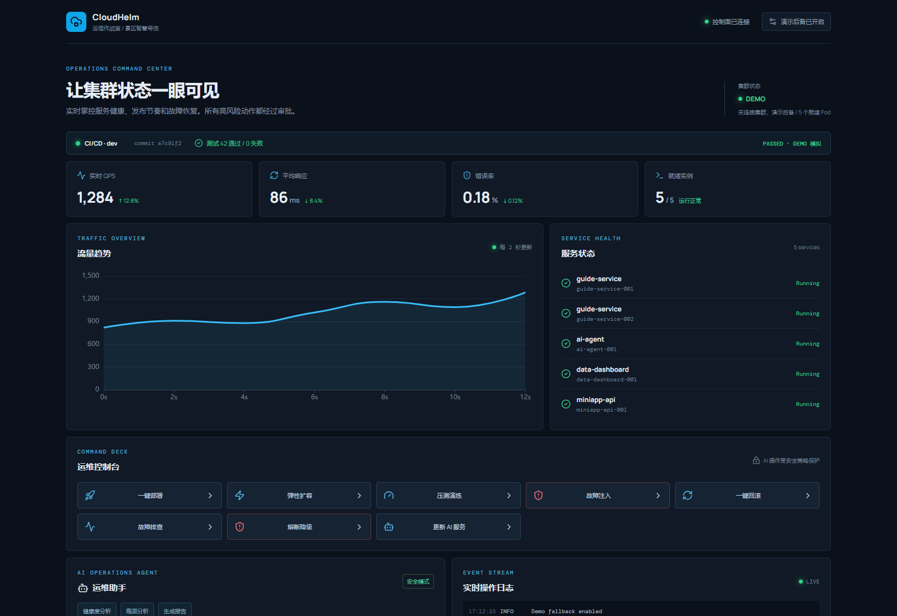

# CloudHelm 运维作战室

## 本地启动

推荐使用 Docker Compose（会构建 backend/frontend 镜像，前端 Nginx 通过服务名 `backend` 代理 HTTP 和 WebSocket）：

```bash
docker compose up
```

前端地址：`http://localhost:5173`，后端 Swagger：`http://localhost:8000/docs`。

本地已有 Python 和 Node 时，也可以运行 `start.sh` 自动安装后端依赖并启动前后端：

```bash
sh start.sh
```

也可以分别运行：

```bash
cd backend && pip install -r requirements.txt
uvicorn app.main:app --reload --port 8000
cd frontend && npm install && npm run dev
```

## 启动自检

在**任何机器**上都可以先跑一次自检。它对无法验证的链路明确报 `SKIP`
（而不是假装通过）：

```bash
python scripts/preflight.py             # 只读静态检查（不需 Docker/K8s）
python scripts/preflight.py --up        # 额外构建并启动 compose 并实测链路
python scripts/preflight.py --deploy    # 额外把 K8s 清单应用到当前集群
```

静态部分覆盖：所需文件、compose 端口 vs nginx listen、nginx 代理、
设置项与两条部署路径的声明一致性、白名单服务是否有可操作工作负载、
命名空间统一性、后端测试。

`--up` 会另测：Docker 守护进程、`compose config`、`compose up --build`、
后端健康检查、前端首页、**nginx 代理 /api**、**WebSocket 日志推送**。

`--deploy` 会另测：集群连通性、应用清单、rollout、
**RBAC 是否允许 list/delete pods 与 patch deployments**、四个被管服务是否到位。

退出码：0 = 无失败（允许 SKIP/WARN）；1 = 存在失败。

> 在有 Docker 和集群的机器上请务必先跑 `--up --deploy`，
> 这是目前唯一能真正验证容器与集群链路的途径。

## 运行模式

- `K8S_ENABLED=true`：尝试读取 kubeconfig 或集群内 ServiceAccount。
- `DEMO_FALLBACK=true`：真实 K8s API 不可用或请求失败时使用连贯的演示状态。
- `DEMO_FALLBACK=false`：K8s 不可用时返回错误，不伪造真实集群结果。
- `ALLOWED_DEPLOYMENTS`：限制 AI 和控制台可操作的 Deployment 名称。
- `IMAGE_REGISTRIES`：允许的镜像仓库（默认 `cloudhelm,registry.local`）。
  镜像是按**完整引用**校验的（仓库 + 路径 + tag/digest），不是前缀匹配 ——
  `cloudhelm/../evil:1`、`cloudhelm/ai:1; rm -rf /` 这类会被拒。
- `PROMETHEUS_URL`：真实模式的 Prometheus 地址；真实模式关闭后备时必须配置，避免把固定演示指标当成真实数据。

页面右上角可切换演示后备。模式和动作结果都会通过 API 响应及日志标记；CI/CD 测试状态当前明确标为 DEMO，不能作为真实流水线证据。真实模式下 Pod 计数和指标计数均来自实时集群/Prometheus。

## K8s 部署

先构建并推送两个镜像：

```bash
docker build -t cloudhelm/backend:demo backend
docker build -t cloudhelm/frontend:demo frontend
```

然后执行：

```bash
kubectl apply -f deploy/namespace.yaml
kubectl apply -f deploy/rbac.yaml
kubectl apply -f deploy/business-services.yaml   # 被托管的 4 个业务服务
kubectl apply -f deploy/backend-deployment.yaml
kubectl apply -f deploy/frontend-deployment.yaml
```

业务服务清单（`deploy/business-services.yaml`）提供导览 / AI 智能体 / 数据大屏 / 小程序后端
四个 **占位工作负载**（Deployment + Service，默认 1 副本，带健康检查、资源限制与 ConfigMap 环境变量）。
真实的业务应用在各自仓库，这里只保证控制面有**可操作的真实对象**：
没有它们，真实集群路径下面板看不到任何业务服务，所有按钮都会 404。

> 关键约束：Deployment 名 = `app` 标签 = 容器名 = `ALLOWED_DEPLOYMENTS` 条目。
> 镜像更新按容器名打补丁，Pod 范围校验按 `app` 标签比对白名单，三者必须一致。

示例 RBAC 仅授权 `cloudhelm` 命名空间内的 Pod 查询/删除和 Deployment 扩缩容/更新，不授予任意命令执行权限。生产环境应进一步按实际服务标签和命名空间收紧。

## 已验证项



以下结果来自本机实际运行（Windows + Git Bash），非仅构建产物：

| 验证项 | 命令/方式 | 结果 |
| --- | --- | --- |
| 后端单元/接口测试 | `python -m pytest -q` | 16 passed |
| 部署配置一致性 | `backend/tests/test_deploy_config.py` | compose 端口/命名空间/nginx 代理交叉校验通过 |
| 前端生产构建 | `npm run build` | 成功 |
| 后端真实启动 | `uvicorn app.main:app` | `/api/health` 返回 ok |
| 前端真实渲染 | 浏览器打开 `:5173` | 页面正常，控制台无报错 |
| `/api` 代理 | `curl :5173/api/health` | 正确转发至后端 |
| WebSocket 日志 | 经 Vite 代理连接 `/api/logs/ws` | 收到日志事件 |
| 控制台交互 | 浏览器点击部署/排查/AI 问答 | 状态与日志按预期更新 |
| 8 个控制按钮全流程 | 浏览器逐个实测（含两级弹窗） | 均正常，见 DEMO-PLAYBOOK |
| 流量曲线动画 | 画布指纹两次采样对比 | 持续变化（非静态图） |
| 扩容→指标联动 | UI 实测扩容后取指标 | QPS 1290→1346，响应 125.3→118.4ms，实例 5→6 |
| 关闭后备后操作 | 浏览器点击部署 | API 503 + UI 报错，**无伪造成功日志** |
| 故障注入→自愈 | 浏览器实测（真实 5 秒延迟） | Pod 变红 `rgb(242,110,118)` → 5s 后变绿 `rgb(53,203,142)`，restarts +1 |
| 投影仪分辨率 | 浏览器 resize 实测 1280×720 / 1366×768 / 1920×1080 / 1024×768 | 无横向溢出；5 个 Pod 与 8 个按钮均入首屏 |
| 清空日志 | 浏览器点击后刷新页面 | 日志归零且**刷新后不再出现**（服务端同步清除），审计留痕 |
| 指标环比箭头 | 浏览器读取 DOM | 由上一次采样实时计算（如 QPS ↓0.79% bad / 响应 ↓1.81% good），非写死 |
| Pod 三态颜色 | 浏览器实测扩容瞬间 | 绿 `rgb(53,203,142)` / 黄 `rgb(224,178,63)` ContainerCreating / 红 `rgb(242,110,118)`，见图 `screenshot-pod-states.png` |
| 部署配置对齐 | `test_deploy_config.py` 静态交叉校验 | 环境变量、端口、命名空间、白名单服务与容器名一致性均有断言（已做反向验证确认非空转） |
| 全端联调 | 浏览器点击 + 接口实测 | 4/4 通过；杀掉某服务全部副本后变为 3/4 并指出 `failed=['ready']` |
| 演示剧本一致性 | `test_playbook_contract.py` | 逐一断言剧本引用的 11 条日志/文案与真实行为一致（已做变异验证） |

未验证（受环境限制）：`docker compose up` 与真实 K8s 集群联调 —— 本机没有 Docker 与 kubeconfig。

## 演示流程

完整的 40 分钟编排、现场提问清单与**降级方案**（出问题怎么办）见 [DEMO-PLAYBOOK.md](./DEMO-PLAYBOOK.md)。

简要流程：

1. 打开监控大屏，确认服务状态、指标和日志流。
2. 执行一键部署，观察版本号和成功日志。
3. 执行弹性扩容，再运行压测演练，观察副本和指标变化。
4. 选择故障注入，完成两次确认，观察高风险拦截、自愈日志和状态变化。
5. 在 AI 助手中询问健康度、瓶颈或报告；涉及扩容时必须人工批准。
6. 切换关闭演示后备，可验证无 K8s 时系统明确返回失败，而不是伪造成功。

## 审计日志

所有状态变更操作都写入结构化审计轨迹，现场可查：

```bash
curl -s http://localhost:8000/api/audit
```

字段：`action_type` / `target` / `risk` / `decision`（pending、approved、rejected、executed）/ `operator` / `timestamp`。
本 MVP 不含登录体系，`operator` 由调用方自报，默认 `control-panel`。

## 已知边界

真实模式下，Pod、扩缩容、发布 annotation、删 Pod和镜像更新经过 Kubernetes Python 客户端执行；指标通过 Prometheus 查询。压测、流量趋势、诊断和熔断流程提供演示适配，页面操作结果会明确显示 DEMO；它们不代表真实压测或生产变更。完整 OpenTelemetry、CI/CD 外部系统和真实大模型供应商接入不在本 MVP 内。
